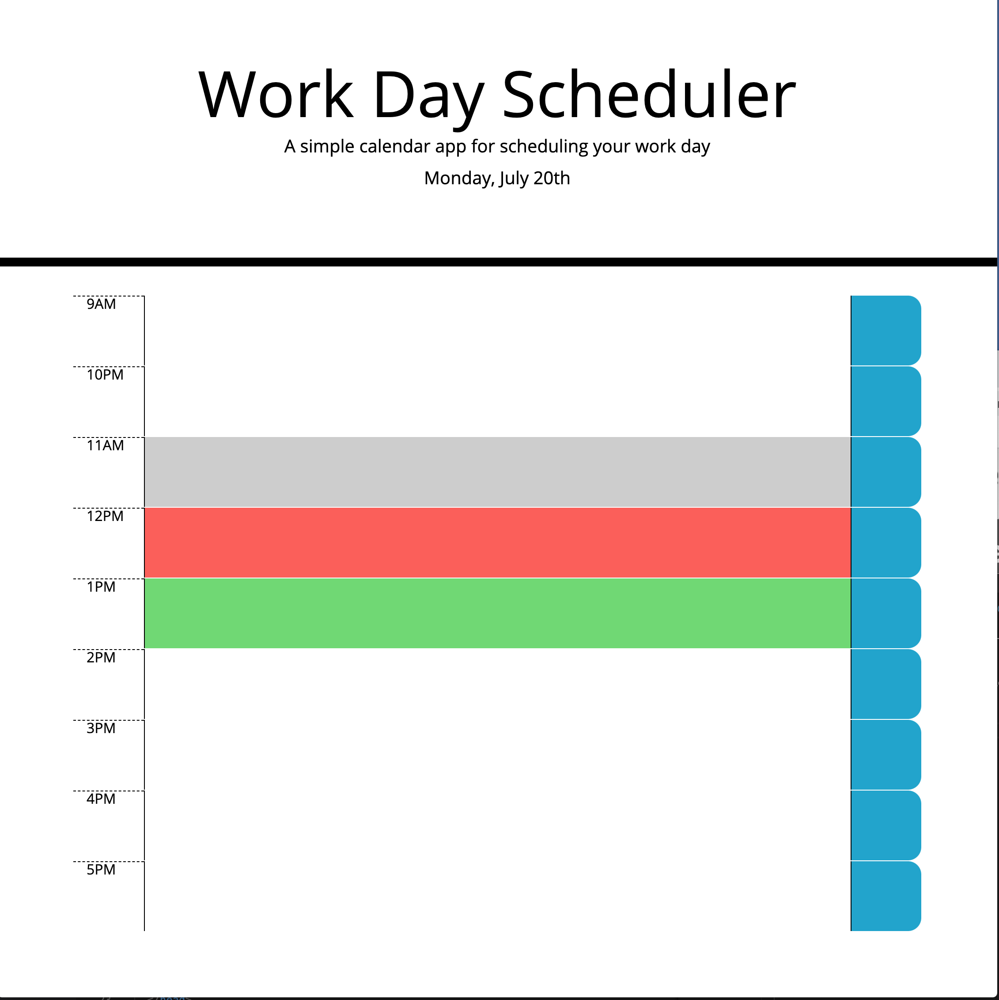

# HW5-Work-Day_Scheduler

https://macksm3.github.io/HW5-Work-Day-Scheduler/

using the provided css file as guide, I created html to match layout in provided asset image.

Created a basic clock for the page and used that to create the code to change the time block colors based on what time it is now. 

added fontawesome icon for save button. 

addeded local storage ans everything is working but not very DRY

added daySchedule array to hold all 9 text area descriptions in single element

